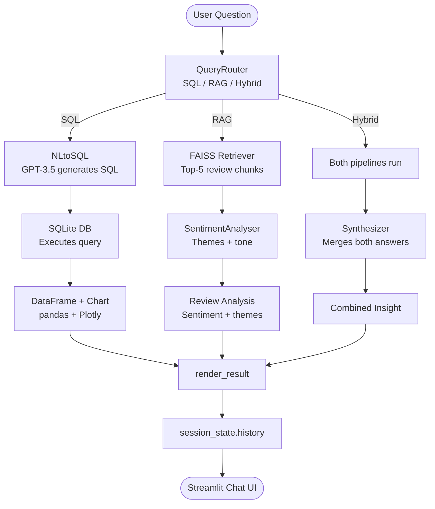

```mermaid
flowchart TD
    A([User Question]) --> B[QueryRouter\nSQL / RAG / Hybrid]

    B -->|SQL| C[NLtoSQL\nGPT-3.5 generates SQL]
    B -->|RAG| G[FAISS Retriever\nTop-5 review chunks]
    B -->|Hybrid| D[Both pipelines run]

    C --> E[SQLite DB\nExecutes query]
    E --> F[DataFrame + Chart\npandas + Plotly]

    G --> H[SentimentAnalyser\nThemes + tone]
    H --> I[Review Analysis\nSentiment + themes]

    D --> J[Synthesizer\nMerges both answers]
    J --> K[Combined Insight]

    F --> L[render_result]
    I --> L
    K --> L

    L --> M[session_state.history]
    M --> N([Streamlit Chat UI])
```